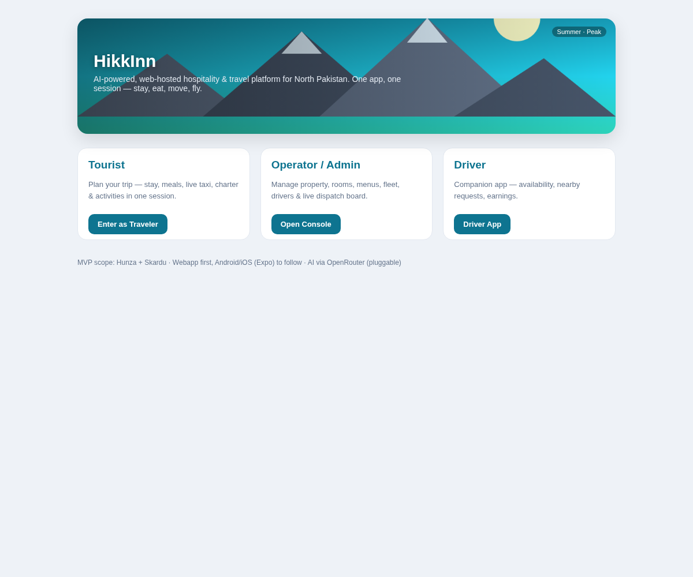
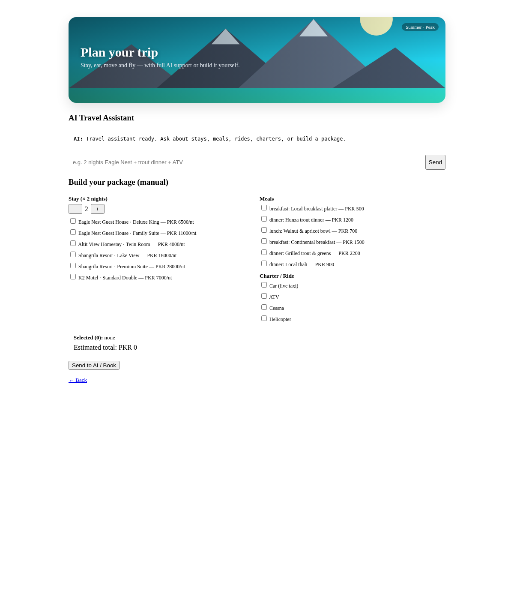
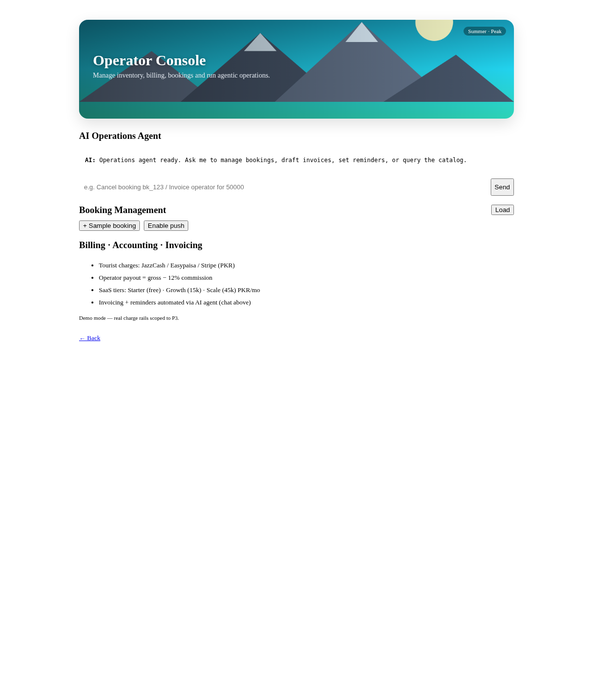
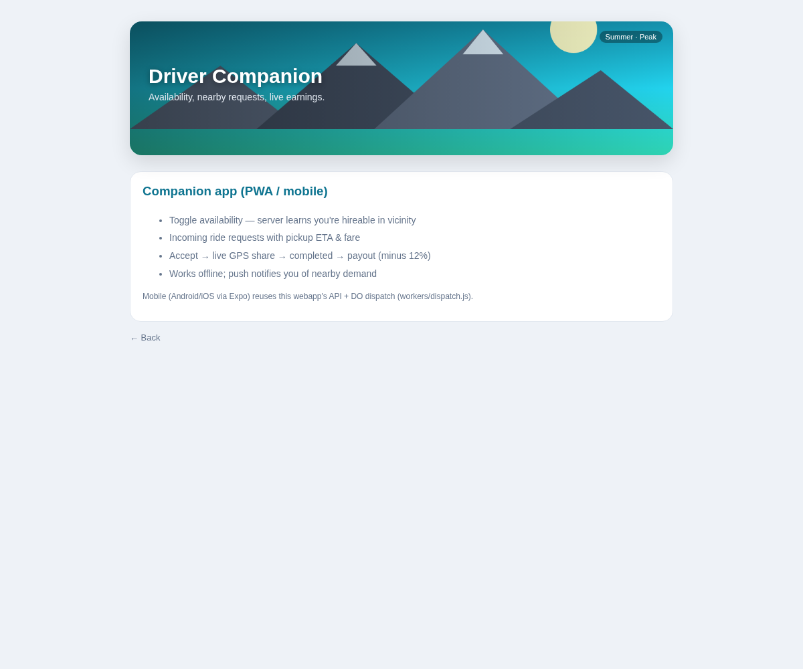
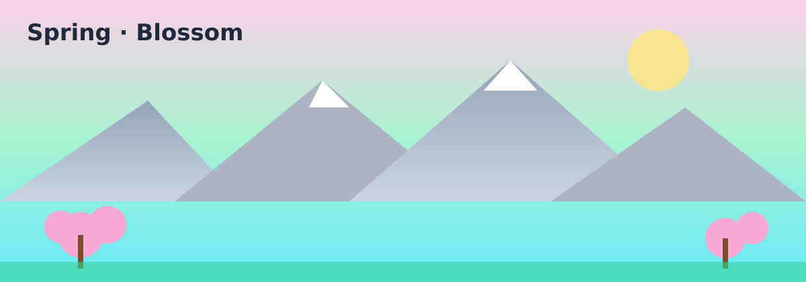
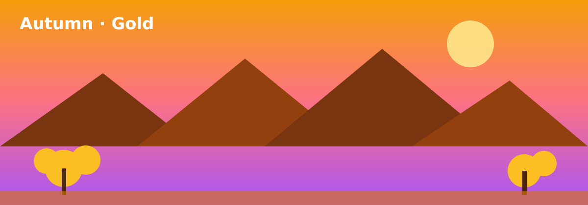
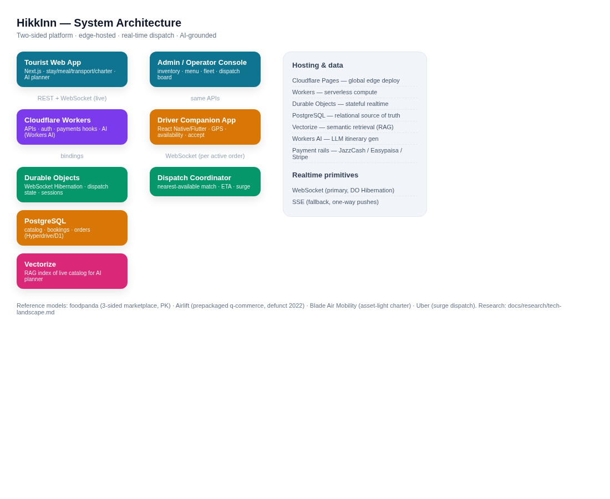
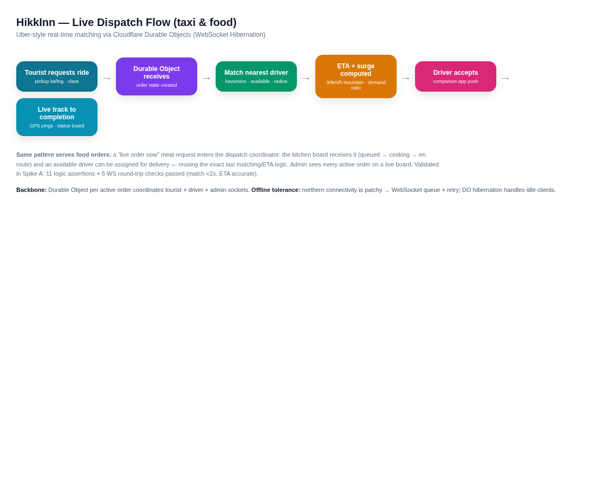

# HikkInn

**AI-powered, web-hosted hospitality & travel platform for North Pakistan.**

HikkInn replaces conventional manual booking/operations systems in the northern
Pakistan tourism sector with a single, automated, two-sided platform.

- **Admin side** — property & service management (guest houses, hotels, resorts,
  tours, flights, car/vehicle charters, activities, menus).
- **Tourist / end-user side** — travel & stay customization: rooms, meals
  (per-day / per-meal, prepackaged), transportation (live, Uber-style), and
  adventure activities (paragliding, skydiving, heli tours, etc.).
- **AI (both sides)** — OpenRouter default, pluggable (Gemini/OpenAI/Anthropic/
  compat/Ollama). Grounded **RAG** agentic assistant for admin ops + tourist
  planning, with booking management, billing/accounting/invoicing, reminders.
  See [`docs/agentic-ai.md`](docs/agentic-ai.md).

> Awarded project — upgrade manual systems → automated, AI-assisted, web-hosted
> combined services.

---

## Screenshots & diagrams (live app)

Real screenshots of the running webapp (not mockups). Full set in
[`docs/assets/`](docs/assets/).

### Home — role entry (Tourist / Operator / Driver)


### Tourist app — stay · meals · live taxi · charter · AI · push


### Operator console — inventory, billing, agentic AI assistant


### Driver companion — availability · nearby requests · earnings


### Seasonal theming (auto by date, manual override)
 
 

### System architecture


### Live dispatch flow (Uber-style, Durable Objects WebSocket)


---

## Repository layout

```
HikkInn/
├── README.md                      # this file
├── docs/
│   ├── vision.md                  # product vision & two-sided model
│   ├── architecture.md            # recommended tech stack (2026)
│   ├── domain-model.md            # entities: property, room, meal, vehicle, charter...
│   ├── admin-side.md              # admin capabilities spec
│   ├── tourist-side.md            # tourist capabilities spec
│   ├── live-dispatch.md           # Uber-style live taxi/food dispatch design
│   ├── charter.md                 # aircraft/ATV charter booking model
│   ├── ai-customization.md        # AI itinerary & recommendation design
│   ├── mvp-scope.md               # MVP scope (in/out, phases, metrics)
│   ├── spike-plan.md              # technical spike plan
│   ├── assets/                    # wireframe + diagram PNGs
│   ├── research/                  # Jul 2026 raw market/supply/tech research
│   └── stakeholder/               # investor / steering docs (see below)
├── spike/                         # throwaway proof-of-concepts (A/B/C)
└── (build code lands here as P0 begins)
```

### Stakeholder & business pack (`docs/stakeholder/`)
- `01-market-research.md` — North Pakistan market (Jul 2026)
- `02-demographic-research.md` — traveler & supplier segments
- `03-business-analytics.md` — TAM/SAM/SOM, unit economics
- `04-architecture.md` — stakeholder architecture brief
- `05-risk-management.md` — risk register & issues to dial in
- `06-blueprint.md` — phased build plan (P0–P4)
- `07-walkthrough-presentation.md` — 13-slide deck narrative + speaker notes

---

## Research basis

All product decisions are grounded in **July 2026** market, supply, and
technology research — see `docs/research/`. Where public data could not be
verified, items are explicitly marked `[NV]` (no verification) rather than
fabricated; primary-data acquisition is scoped in the stakeholder pack.

*Last updated: 2026-07-17 — screenshots refreshed to live webapp; seasonal art added*
